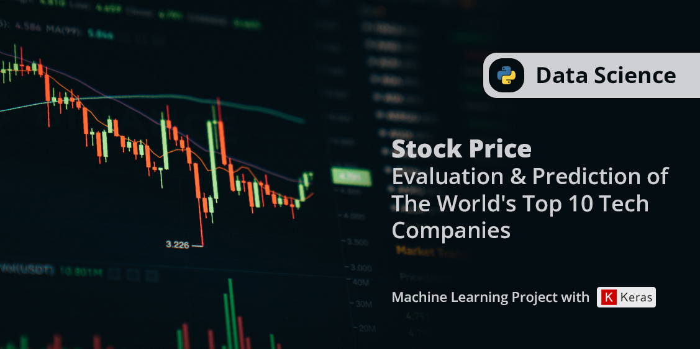

# Risk and Return on Investment in The 10 Biggest Tech Companies in The World & Predictions for The Future

## Overview
- Evaluate the risk and return of 10 stocks of The World's Biggest Technology Companies 5 years ago to date based on annual Sharpe Ratios.
- Create a tool that functions to provide stock price predictions from companies that have the highest annual sharpe ratio evaluation results in previous evaluations.
- Machine learning with LSTM (Long Short Term Memory) model is used to predict stock prices.
- All datasets are provided from Yahoo! Finance's API. So, each daily runtime will provide the latest evaluation and prediction results.
- All graph in interactive for better visualization dan analyst experience.

## Code and Resources Used
**Python Version:** 3.10.3  
**Packages:** numpy, pandas, tensorflow, matplotlib, yfinance, plotly, cufflinks, sklearn, keras, datetime    
**Dataset source:** Yahoo! Finance's API

## Interactive View
https://nbviewer.org/github/Underscore48/Stock_Evaluation_of_10_Big_Tech/blob/main/stock.ipynb
